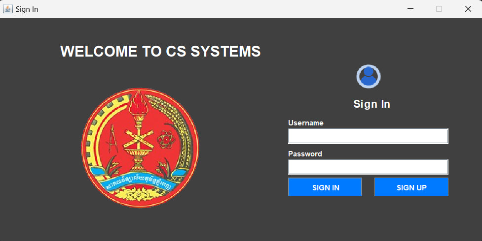
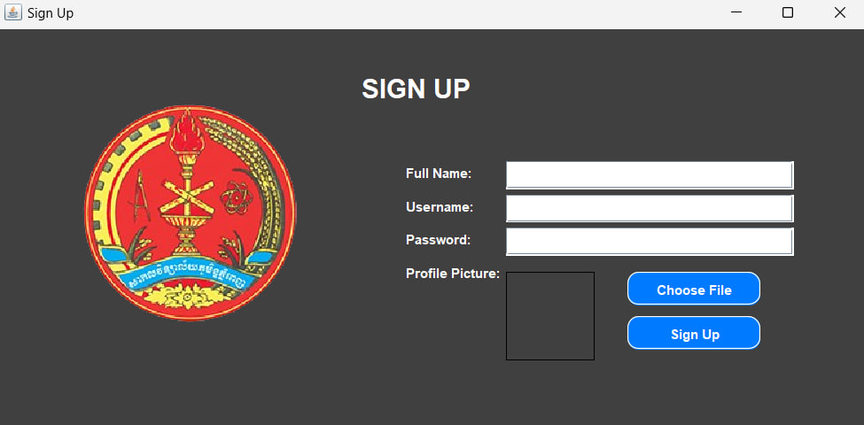
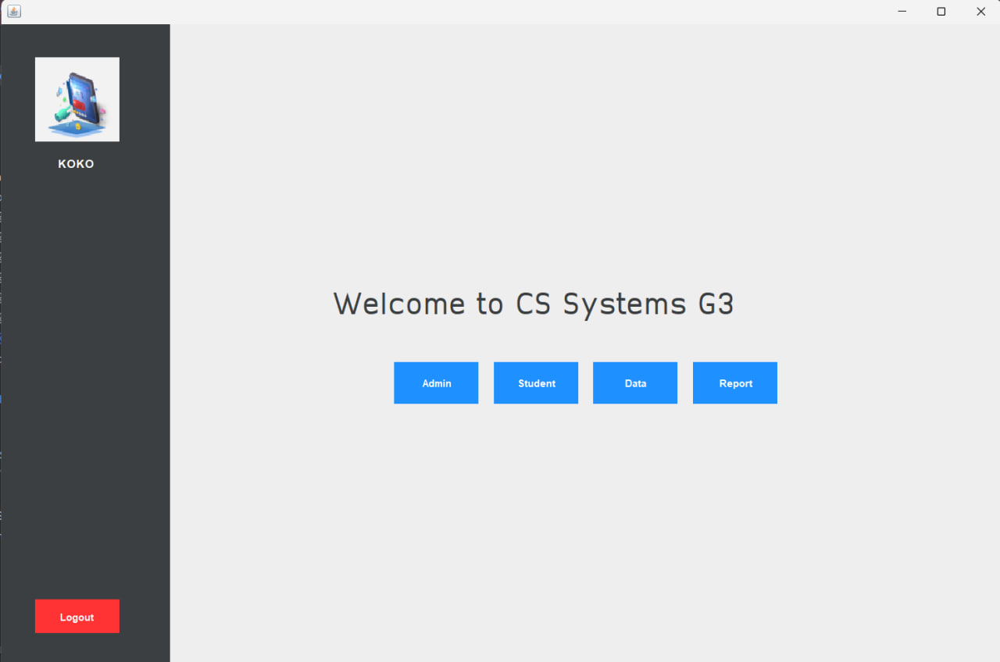
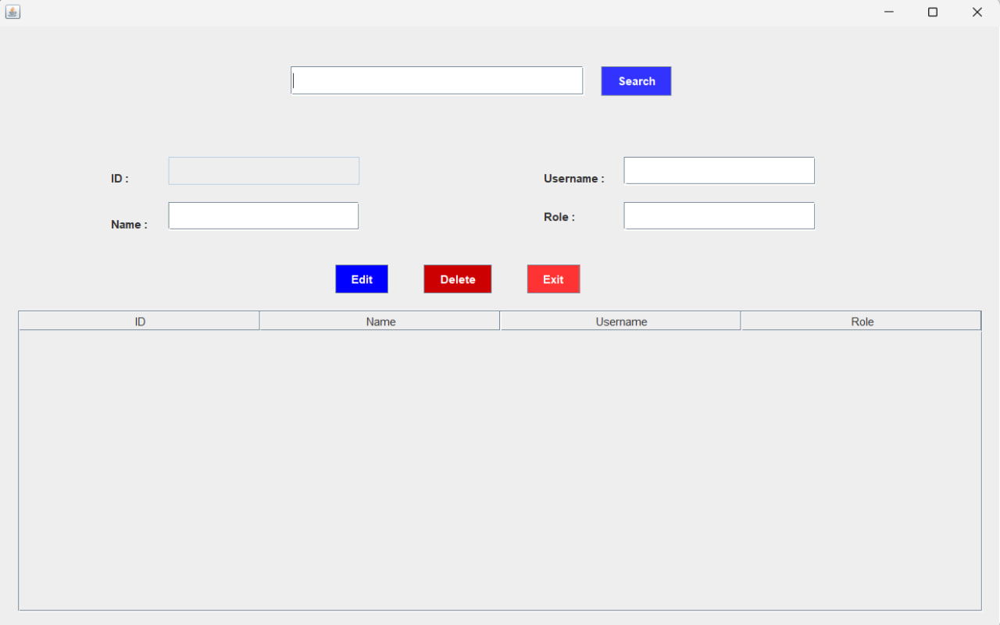
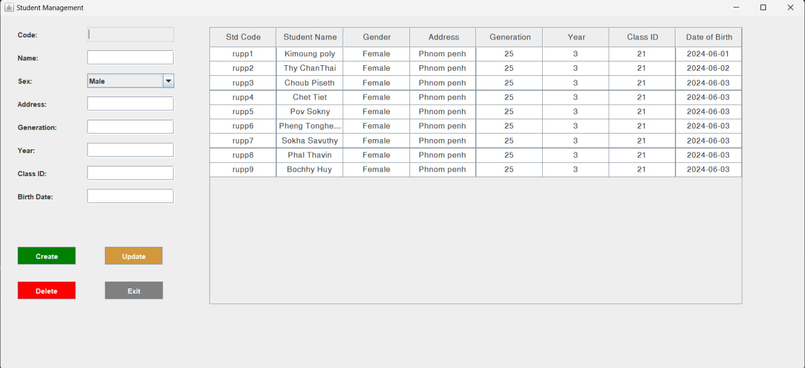
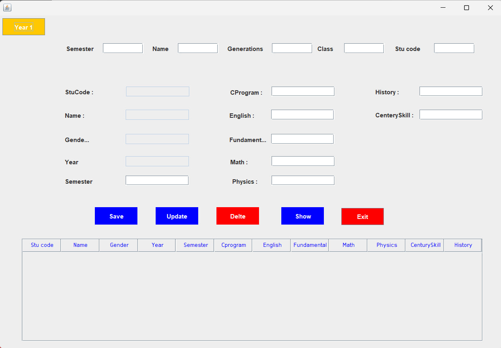
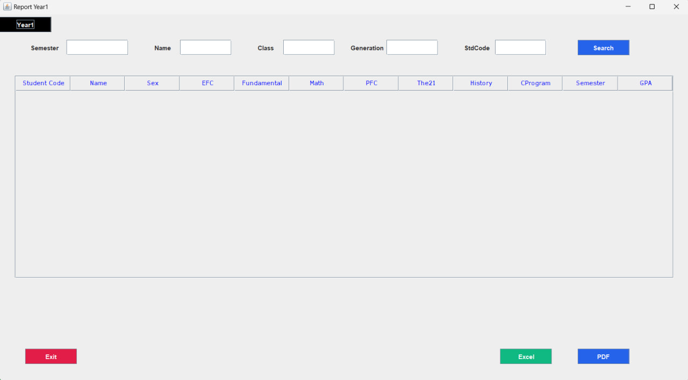

# Desktop Java Management Systems - Point of Computer Since Students

This is a Java Desktop Application designed as a management system to streamline administrative tasks and data handling for computer science students. Built with Java and Gradle and using Microsoft Access as the database, the project includes various features tailored to support administrative roles, student management, data organization, and report generation.

This project was developed collaboratively as part of the Semester 2 curriculum in Years 3.
## Features

